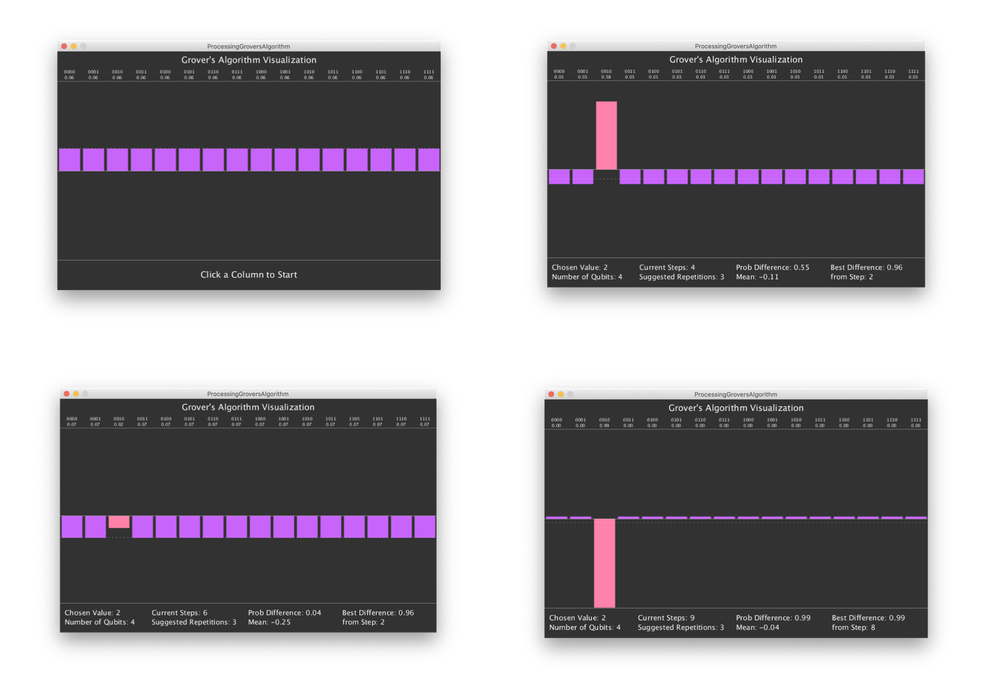

# Grover's Algorithm Visualization in Processing

_by Austin Poor_

A visualization of [Grover's Algorithm](https://en.wikipedia.org/wiki/Grover%27s_algorithm) for unstructured search written in Processing.

I wrote this as part of a project for my Quantum Computing course at Sarah Lawrence College.

The sketch displays the relative frequencies for each possible final qubit state. The following screenshot shows 4 different states:

